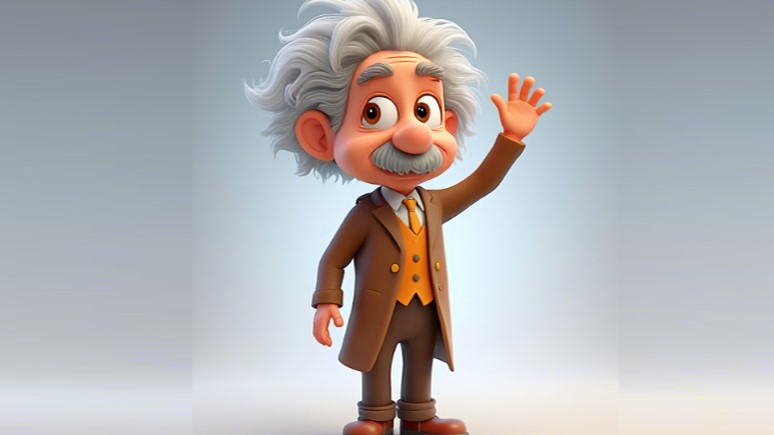

<div align="center">
  
# Taming Rectified Flow for Inversion and Editing

[Jiangshan Wang](https://scholar.google.com/citations?user=HoKoCv0AAAAJ&hl=en)<sup>1,2</sup>, [Junfu Pu](https://pujunfu.github.io/)<sup>2</sup>, [Zhongang Qi](https://scholar.google.com/citations?hl=en&user=zJvrrusAAAAJ&view_op=list_works&sortby=pubdate)<sup>2</sup>, [Jiayi Guo](https://www.jiayiguo.net)<sup>1</sup>, [Yue Ma](https://mayuelala.github.io/)<sup>3</sup>, <br> [Nisha Huang](https://scholar.google.com/citations?user=wTmPkSsAAAAJ&hl=en)<sup>1</sup>, [Yuxin Chen](https://scholar.google.com/citations?hl=en&user=dEm4OKAAAAAJ)<sup>2</sup>, [Xiu Li](https://scholar.google.com/citations?user=Xrh1OIUAAAAJ&hl=en&oi=ao)<sup>1</sup>, [Ying Shan](https://scholar.google.com/citations?hl=en&user=4oXBp9UAAAAJ&view_op=list_works&sortby=pubdate)<sup>2</sup>

<sup>1</sup> Tsinghua University,  <sup>2</sup> Tencent ARC Lab,  <sup>3</sup> HKUST  

[](https://arxiv.org/abs/2411.04746)
<a href='https://rf-solver-edit.github.io/'></a>

</div>


<p>
We propose <strong>RF-Solver</strong> to solve the rectified flow ODE with less error, thus enhancing both sampling quality and inversion-reconstruction accuracy for rectified-flow-based generative models. Furthermore, we propose <strong>RF-Edit</strong> to leverage the <strong>RF-Solver</strong> for image and video editing tasks. Our methods achieve impressive performance on various tasks, including text-to-image generation, image/video inversion, and image/video editing. 
</p>


<p align="center">

</p>


# 📖 Method
## RF-Solver
<p>

We derive the exact formulation of the solution for Rectified Flow ODE. The non-linear part in this solution is processed by Taylor Expansion. Through higher order expansion, the approximation error in the solution is significantly reduced, thus achieving impressive performance on both text-to-image sampling and image/video inversion.
</p>

## RF-Edit
<p>

Based on RF-Solver, we further propose the RF-Edit for image and video editing. RF-Edit framework leverages the features from inversion in the denoising process, which enables high-quality editing while preserving the structual information of source image/video. RF-Edit contains two sub-modules, espectively for image editing and video editing.
</p>

# 🛠️ Code Setup
The environment of our code is the same as FLUX, you can refer to the [official repo](https://github.com/black-forest-labs/flux/tree/main) of FLUX, or running the following command to construct the environment.
```
conda create --name RF-Solver-Edit python=3.10
conda activate RF-Solver-Edit
pip install -e ".[all]"
```
# 🚀 Examples for Image Editing
We have provided several scripts to reproduce the results in the paper, mainly including 3 types of editing: Stylization, Adding, Replacing. We suggest to run the experiment on a single A100 GPU.

## Stylization
<table class="center">
<tr>
  <td width=10% align="center">Ref Style</td>
  <td width=30% align="center"></td>
	<td width=30% align="center"></td>
  <td width=30% align="center"></td>
</tr>
<tr>
  <td width="10%" align="center">Editing Scripts</td>
  <td width="30%" align="center"><a href="src/run_nobel_trump.sh">Trump</a></td>
  <td width="30%" align="center"><a href="src/run_art_mari.sh"> Marilyn Monroe</a></td>
  <td width="30%" align="center"><a href="src/run_cartoon_ein.sh">Einstein</a></td>
</tr>
<tr>
  <td width=10% align="center">Edtied image</td>
  <td width=30% align="center"></td>
	<td width=30% align="center"></td>
  <td width=30% align="center"></td>
</tr>

<tr>
  <td width="10%" align="center">Editing Scripts</td>
  <td width="30%" align="center"><a href="src/run_nobel_biden.sh">Biden</a></td>
  <td width="30%" align="center"><a href="src/run_art_batman.sh">Batman</a></td>
  <td width="30%" align="center"><a href="src/run_cartoon_herry.sh">Herry Potter</a></td>
</tr>
<tr>
  <td width=10% align="center">Edtied image</td>
  <td width=30% align="center"></td>
	<td width=30% align="center"></td>
  <td width=30% align="center"></td>
</tr>
</table>

## Adding & Replacing
<table class="center">
<tr>
  <td width=10% align="center">Source image</td>
  <td width=30% align="center"></td>
	<td width=30% align="center"></td>
  <td width=30% align="center"></td>
</tr>
<tr>
  <td width="10%" align="center">Editing Scripts</td>
  <td width="30%" align="center"><a href="src/run_boy.sh">+ hiking stick</a></td>
  <td width="30%" align="center"><a href="src/run_horse.sh">horse -> camel</a></td>
  <td width="30%" align="center"><a href="src/run_boy.sh">+ dog</a></td>
</tr>
<tr>
  <td width=10% align="center">Edtied image</td>
  <td width=30% align="center"></td>
	<td width=30% align="center"></td>
  <td width=30% align="center"></td>
</tr>

</table>


# Acknowledgements
We thank [FLUX](https://github.com/black-forest-labs/flux/tree/main) for their clean codebase.

# Contact
The code in this repository is still being reorganized. Errors that may arise during the organizing process could lead to code malfunctions or discrepancies from the original research results. If you have any questions or concerns, please send email to wjs23@mails.tsinghua.edu.cn.